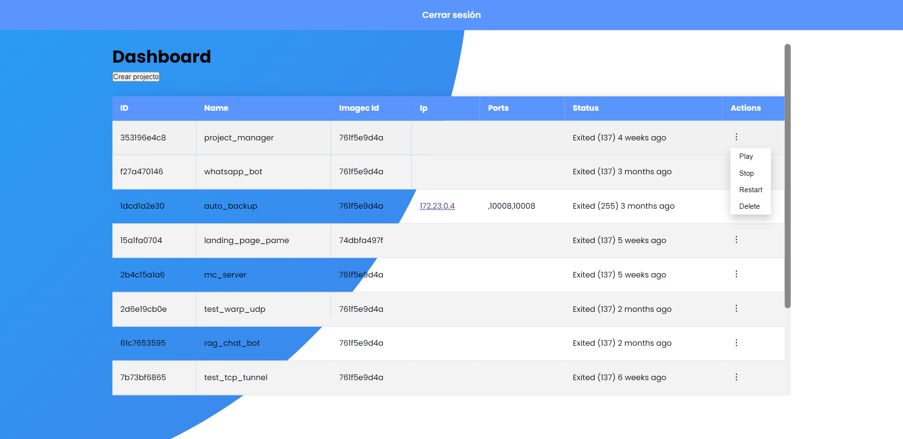
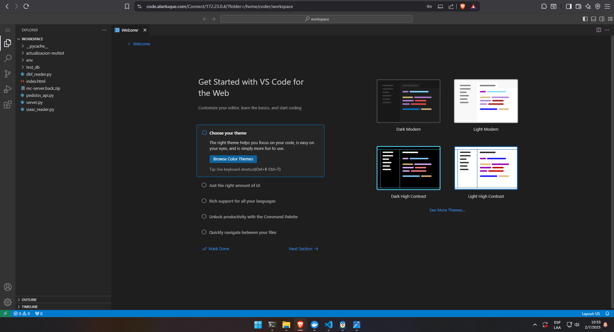

# 🧠 code_manager

**Entorno de desarrollo remoto multiplataforma** basado en Docker, que permite ejecutar proyectos en Python/Django directamente desde el navegador usando `code-server` (VSCode en el browser).

---

## 🚀 Descripción

`code_manager` es una herramienta que replica un entorno de desarrollo como GitHub Codespaces pero en local o en servidores propios. Está pensada para facilitar la edición y ejecución de proyectos desde cualquier dispositivo, sin necesidad de configurar el entorno manualmente.

Ideal para pruebas rápidas, desarrollo remoto, demostraciones o entornos de enseñanza.

---

## 📸 Captura de pantalla

### Dashboar



### Editor



---

## 🛠️ Tecnologías utilizadas

- 🐍 Python
- 🌐 Django
- 🐳 Docker
- 🧩 code-server (VSCode en navegador)
- ⚙️ Nginx
- 🐘 SQLite 

---

## ✅ Requisitos

- Docker
- Docker Compose
- Navegador web moderno

---

## ⚙️ Instalación y uso

```bash
# 1. Clonar el repositorio
git clone https://github.com/Stradivariuskein/code_manager
cd code_manager

# 2. Construir y correr los contenedores 
# Windows:
install.bat

# Linux:
install.sh

# 3. Acceder al entorno de desarrollo
# Por defecto: http://localhost:10443
```

---

## 🧩 Versiones disponibles

El proyecto cuenta con **dos versiones**:

- `master`: versión normal.
- `demo`: versión demostración.

### 🔧 Instalación de la versión demo

#### ✅ Si ya tenés la versión normal instalada:

Instalá la rama `demo` de forma normal, siguiendo los pasos anteriores.

#### ⚠️ Si instalás **solo** la demo (sin tener la versión normal):

1. **Cloná la rama demo** en un entorno separado:

```bash
git clone -b demo https://github.com/Stradivariuskein/code_manager code_manager_demo
cd code_manager_demo
```

2. **Modificá el archivo `docker-compose.yml`**:

- **Descomentá** el bloque del servicio `portainer`:

```yaml
  portainer:
    image: portainer/portainer-ce
    container_name: portainer
    restart: always
    volumes:
      - /var/run/docker.sock:/var/run/docker.sock
      - portainer_data:/data
    ports:  
      - "9443:9443"
    networks:
      manager:
        ipv4_address: 172.32.0.4  # <-- recordá esta IP
```

- **Actualizá la IP de `PORTAINER_IP`** en la sección `demo_web`:

```yaml
  demo_web:
    build:
      context: ./project_manager
    restart: always
    volumes:
      - ./project_manager:/app
    depends_on:
      - demo_nginx_proxy
      #- portainer
    networks:
      manager:
        ipv4_address: 172.32.0.3
      code_manager_manager:
        ipv4_address: 172.22.0.10
    environment:
      - PROXY_IP=172.32.0.2
      - PORTAINER_IP=172.22.0.4  # <-- cambiá esta IP
```

3. **Ejecutá el script de instalación** normalmente:

```bash
# Windows:
install.bat

# Linux:
install.sh

# Acceder al entorno de desarrollo
# Por defecto: http://localhost:11443
```
## 🔑 Cargar un token en la demo

Para habilitar el ingreso de un token en la versión demo, editá el archivo:

```
statics/dashboard.js
```

### ✏️ Cambios necesarios:

- Comentá la primera línea de la función `createTokenForm`:

```js
//alert("Esta funcion no esta habilitada para la demo")
```

- Descomentá el resto del bloque de la función `createTokenForm(event)`.

```js
function createTokenForm(event) {
    //alert("Esta funcion no esta habilitada para la demo")
    event?.stopPropagation(); 
    document.querySelectorAll('button[name="modalBtn"]').forEach(btn => btn.disabled = true);

    const card = document.createElement('div');
    card.classList.add('card');

    const form = document.createElement('form');
    form.innerHTML = `
        <div class="input-field">
            <label>Token</label>
            <input type="text" name="token" placeholder="Nuevo token" required>
        </div>
        <button id="submit_token_btn" type="submit" class="btn solid">Enviar</button>
    `;

    let loadingModal;

    form.addEventListener('submit', async function(event) {
        event.preventDefault(); 
        const submitButton = document.getElementById('submit_token_btn');
        submitButton.disabled = true;

        loadingModal = document.createElement('div');
        loadingModal.innerHTML = `
            <div id="loadingModal" style="
                position: fixed;
                top: 0; left: 0;
                width: 100%; height: 100%;
                background-color: rgba(0,0,0,0.6);
                display: flex;
                justify-content: center;
                align-items: center;
                z-index: 1000;
            ">
                <div style="background: white; padding: 30px; border-radius: 10px; text-align: center;">
                    <div class="loader" style="
                        border: 4px solid #f3f3f3;
                        border-top: 4px solid #3498db;
                        border-radius: 50%;
                        width: 40px;
                        height: 40px;
                        animation: spin 1s linear infinite;
                        margin: 0 auto 10px;
                    "></div>
                    <p>Enviando token...</p>
                </div>
            </div>
        `;
        document.body.appendChild(loadingModal);

        const token = form.elements['token'].value;
        console.log(token)

        try {
            const response = await fetch('/account/changetoken', {
                method: 'POST',
                headers: {
                    'Content-Type': 'application/json',
                    'X-CSRFToken': getCsrfToken()
                },
                body: JSON.stringify({ token: token })
            });

            if (!response.ok) {
                const errorData = await response.json();
                document.getElementById("msj").innerHTML = errorData.error || "Error desconocido";
                throw new Error(`HTTP error! status: ${response.status}`);
            }

            const result = await response.json();
            document.getElementById("msj").innerHTML = result.message || 'Token actualizado correctamente!';
        } catch (error) {
            console.error('Error:', error);
            alert('Error al enviar el token');
        } finally {
            if (loadingModal && loadingModal.remove) loadingModal.remove();
            submitButton.disabled = false;
            card.remove();
            document.querySelectorAll('button[name="modalBtn"]').forEach(btn => btn.disabled = false);
        }
    });

    form.className = "sign-in-form";
    card.appendChild(form);
    document.body.appendChild(card);
    document.addEventListener('click', handleClickOutsideCard);
}
```

Esto habilitará el ingreso de un token manualmente desde el frontend en la versión demo.